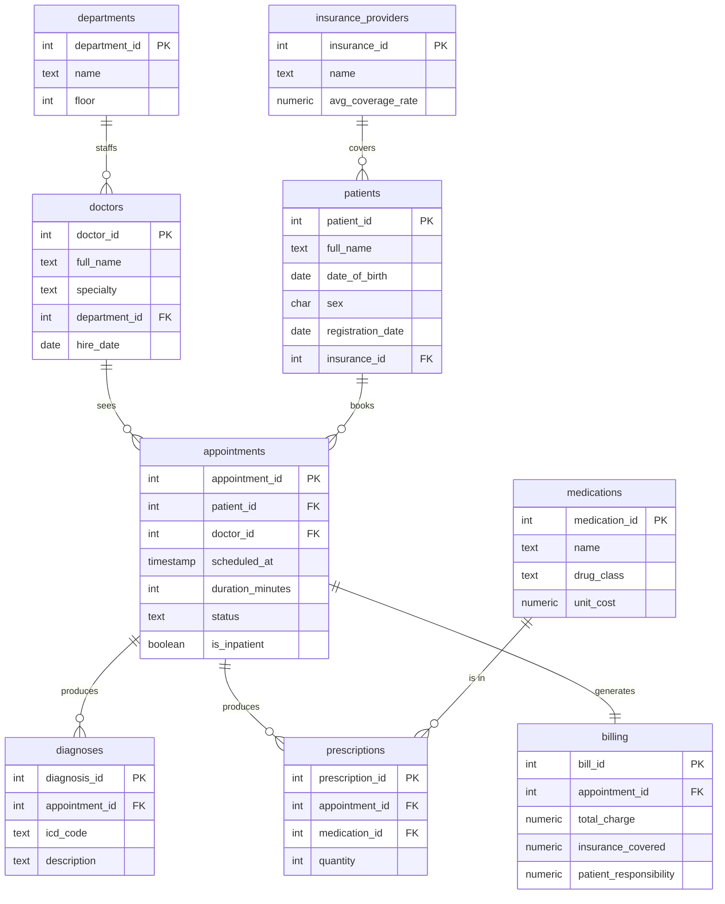

# 🏥 Hospital Operations & Patient Analytics (SQL)

A PostgreSQL project that models a hospital's operational data — patients, doctors,
appointments, diagnoses, prescriptions, insurance, and billing — and answers the kind
of analytical questions a hospital administrator or health-data analyst actually asks:
no-show rates, doctor utilization, **30-day readmission rates**, prescription trends,
and revenue by department.

> ⚠️ **All data in this project is 100% synthetic**, generated in pure SQL. No real
> patient information is used. This is a portfolio/demo project and is not intended for
> any clinical use.

---

## Schema



| Table | What it holds |
|-------|---------------|
| `departments` | Hospital departments (Cardiology, Oncology, …) |
| `doctors` | Physicians, each assigned to a department |
| `patients` | Patient demographics + insurer (NULL = self-pay) |
| `insurance_providers` | Insurers and their average coverage rate |
| `appointments` | Visits: time, duration, status, inpatient flag |
| `diagnoses` | ICD-coded diagnoses tied to an appointment |
| `medications` | Drug catalog (class, unit cost) |
| `prescriptions` | Meds prescribed at an appointment |
| `billing` | One bill per completed visit; insurer vs. patient split |

---

## Quick start

**Requirements:** PostgreSQL, and [`uv`](https://astral.sh/uv) (for the charts).
On WSL/Ubuntu without systemd, start Postgres with `sudo service postgresql start`.

```bash
# 1. clone
git clone git@github.com:Rodrigofch7/sql-health-care.git
cd sql-health-care

# 2. run everything: starts Postgres, (re)creates the database,
#    loads the schema + synthetic data, and generates all charts
./run_all.sh
```

That single command leaves you with a fully loaded `healthcare` database and
seven chart images in [`data_visualization/`](data_visualization/). If you don't
have `uv` yet:

```bash
curl -LsSf https://astral.sh/uv/install.sh | sh
```

### Manual setup (without the script)

If you'd rather run the steps yourself, or only want the database:

```bash
createdb healthcare
psql -d healthcare -f schema.sql
psql -d healthcare -f seed.sql
```

The seed prints row counts at the end so you can confirm the load
(~2,800 appointments across 600 patients and 40 doctors). It uses
`setseed()`, so everyone who clones gets the **same** data.

---

## Showcase queries

See [`queries/`](queries/) for the analytical queries, each with the business
question it answers and sample output. Highlights:

- **30-day readmission rate** — a real healthcare KPI, computed with a window function
- **No-show rate by department and weekday**
- **Doctor utilization** — appointment volume vs. average duration
- **Revenue by department** with the insurance-vs-patient split
- **Most-prescribed medications by patient age bracket**

---

## Notes

Built as a SQL portfolio project. Data generation is done entirely in SQL
(no external Faker/Python dependency) — see `seed.sql`.
