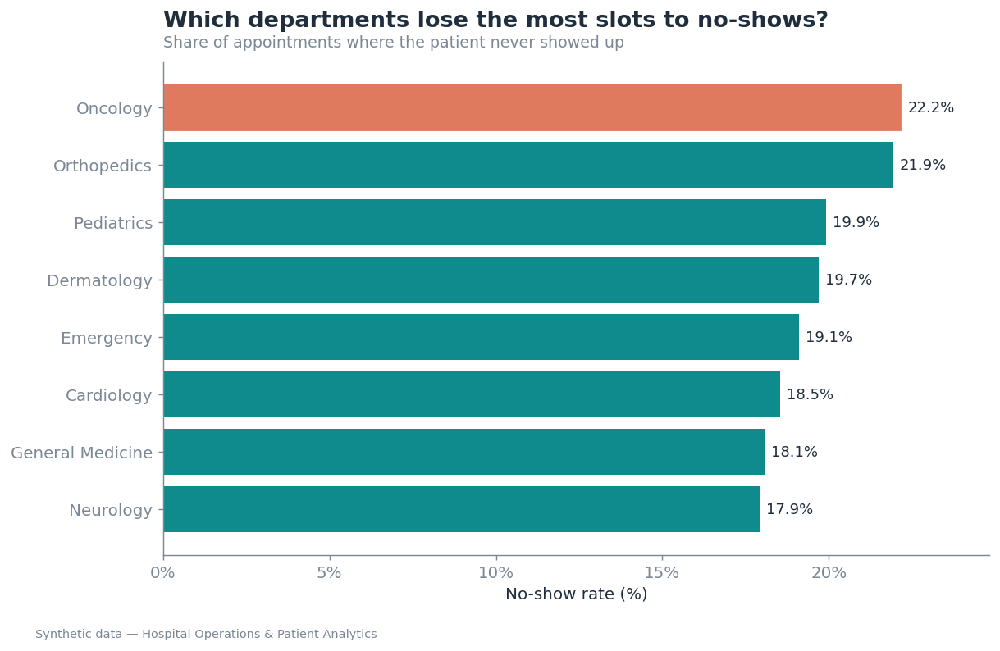
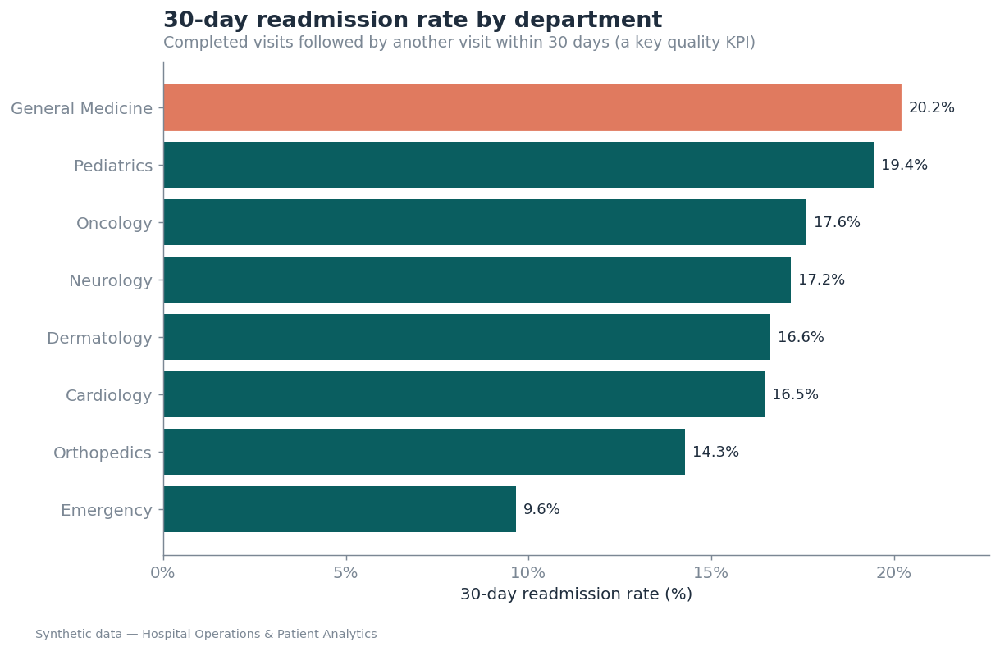
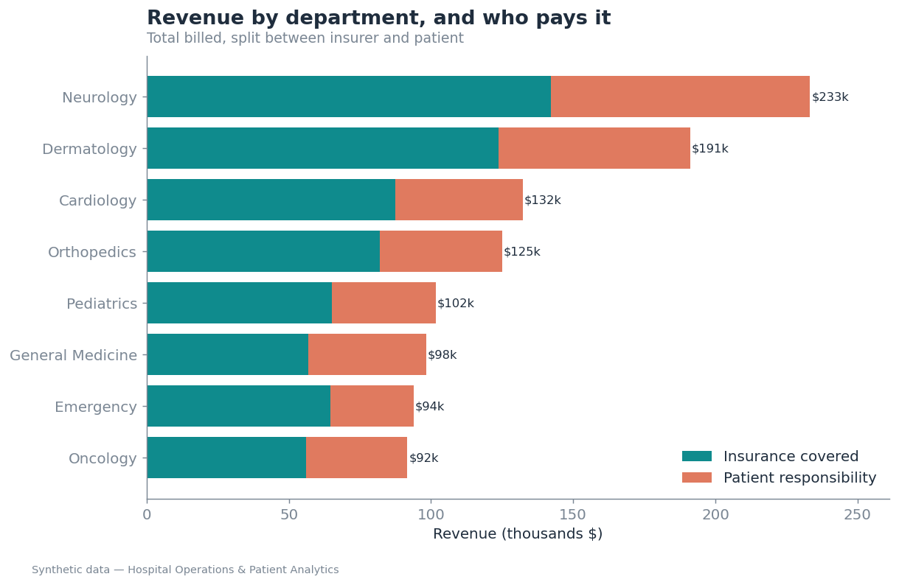
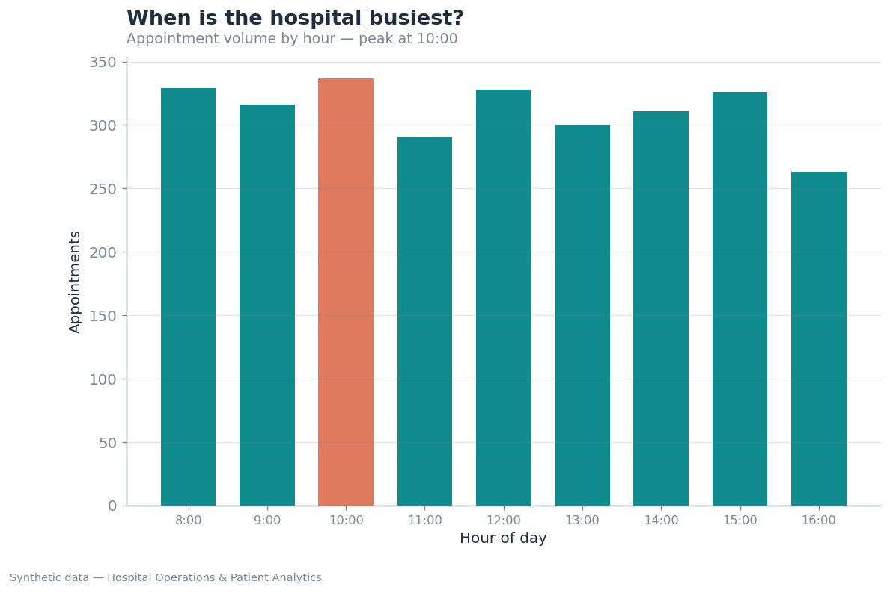
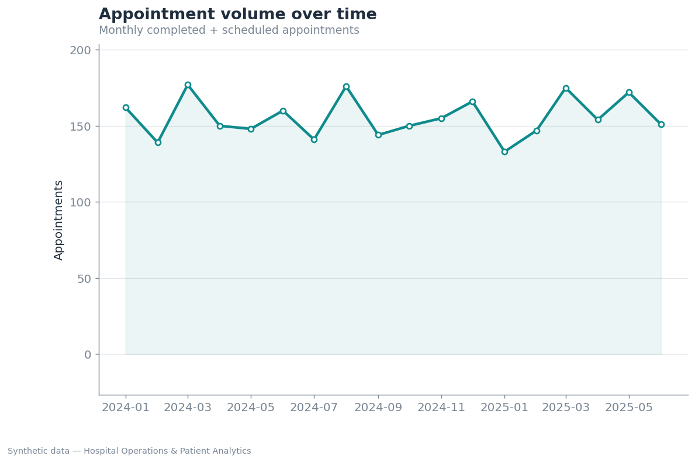
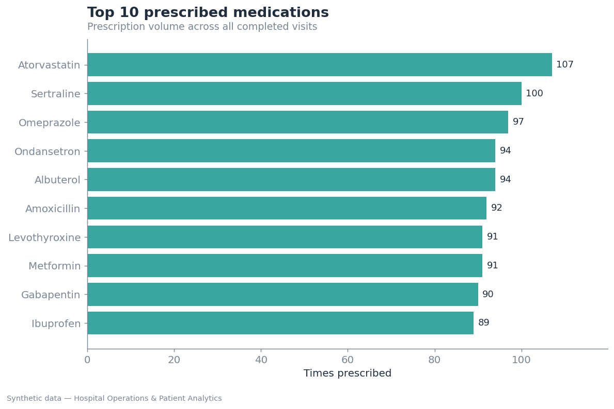
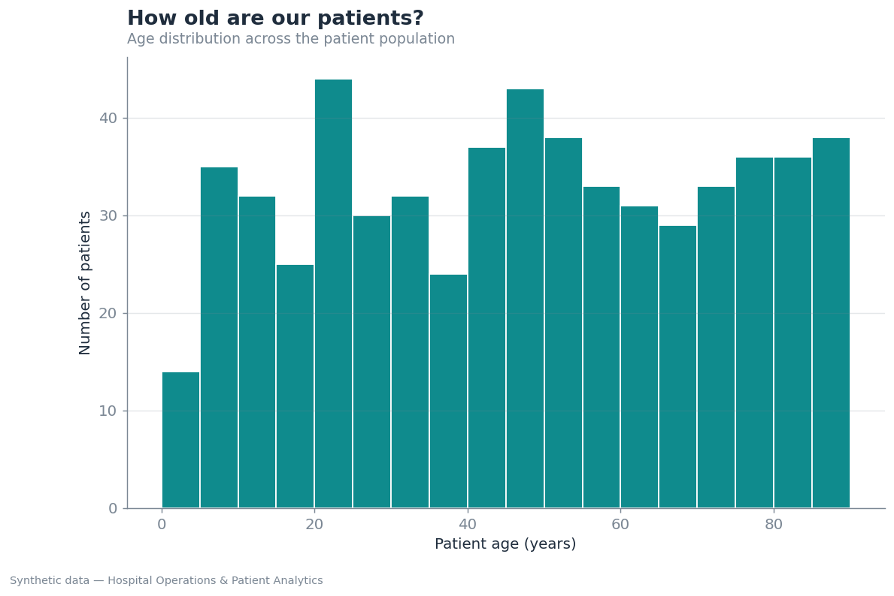

# 📊 Data Visualization

Charts generated from the synthetic hospital database. Each one answers a
question a hospital administrator or health-data analyst would actually ask.

All charts are produced by [`generate_charts.py`](generate_charts.py), which
runs the analytical SQL queries against the `healthcare` database and saves
the images here. Because the data is fixed with `setseed()` (see
[`../seed.sql`](../seed.sql)), regenerating always produces these same charts.

## How to regenerate

```bash
# from the repo root, with Postgres running and the healthcare DB loaded:
pip install -r data_visualization/requirements.txt
python3 data_visualization/generate_charts.py
```

---

### No-show rate by department
Share of appointments where the patient never showed up — a direct hit to
capacity and revenue. Oncology and Orthopedics lose the most slots.



### 30-day readmission rate by department
A real healthcare quality KPI: completed visits followed by another visit from
the same patient within 30 days. Computed with a `LEAD()` window function over
visits partitioned by patient and ordered by date.



### Revenue by department — and who pays it
Total billed per department, split between what insurers cover and what falls
to the patient. A stacked bar over the `billing` table joined back to departments.



### Busiest hours
Appointment volume by hour of day — useful for staffing decisions.



### Appointment volume over time
Monthly appointment trend across the ~18 months of data.



### Top 10 prescribed medications
Prescription volume across all completed visits.



### Patient age distribution
Age spread across the patient population.



---

> All data is synthetic. No real patient information is used.
